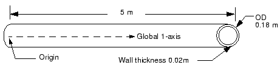
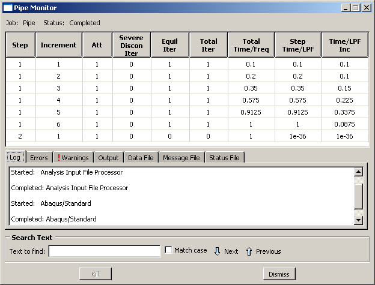
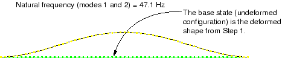
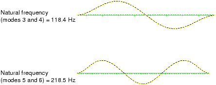

# 11.3 示例：管道系统的振动

在本示例中，您将研究管道系统 5 米长部分的振动频率。该管道由钢制成，外径为 18 厘米，壁厚为 2 厘米（参见图 11-5）。

**图 11-5** 被分析的管道系统的部分。

两个步骤都显示出来，与线性摄动步骤（步骤 2）相关的时间非常小：频率提取过程或任何线性摄动过程不会对模型的总体加载历史做出贡献。

## 11.3.3 后处理

进入 **Visualization** 模块，并打开此作业创建的输出数据库文件 `Pipe.odb`。

**来自线性摄动步骤的变形形状**

Visualization 模块自动使用输出数据库文件上的最后一个可用帧。此模拟第二步的结果是管道的自然模态形状和相应的自然频率。绘制第一模态形状。

**绘制第一模态形状的步骤：**

1. 从主菜单栏中，选择 **Result → Step/Frame**。
   将出现 **Step/Frame** 对话框。
2. 选择步骤 `Frequency I` 和帧 `Mode 1`。
3. 点击 **OK**。
4. 从主菜单栏中，选择 **Plot → Deformed Shape**。
5. 点击工具箱中的  工具以允许视口中显示多个绘图状态；然后点击  工具或选择 **Plot → Undeformed Shape**，将未变形形状绘图添加到视口中的现有变形绘图中。
6. 在两个绘图上包含节点符号（叠加选项控制显示多个绘图状态时未变形形状的外观）。将节点符号的颜色更改为绿色，符号形状更改为实心圆。
7. 点击自动适应工具 ，以便重新调整整个绘图以适应视口。

默认视图是等轴测的。尝试旋转模型以找到第一特征模态的更好视图，类似于图 11-7 中所示。

**图 11-7** 管道部分在拉力下的第一和第二特征模态形状（模态位于彼此正交的平面中）。

与每个特征模态相关的自然频率报告在绘图标题中。当施加 4 MN 拉力载荷时，管道部分的最低自然频率为 47.1 Hz。拉力载荷增加了管道的刚度，从而增加了管道部分的振动频率。此最低自然频率在谐波载荷的频率范围内；因此，当管道与此载荷一起使用时，可能会出现共振问题。

因此，您需要继续模拟并向管道部分施加额外的拉力，直到找到将管道部分自然频率提高到可接受水平的载荷大小。您可以使用 Abaqus 中的重启功能在新的分析中继续先前模拟的加载历史，而不是重复分析并增加施加的轴向载荷。
## 11.3.2 Monitoring the job
## 11.3.3 Postprocessing
