# PEER 结构性能数据库用户手册

**User's Manual（Version 1.0）中文翻译**

Michael Berry  
University of Washington

Myles Parrish  
University of Washington

Marc Eberhard  
University of Washington

Pacific Earthquake Engineering Research Center  
University of California, Berkeley  
January 2004

> 译文说明：本文件依据 `performance_database_manual_1-0.pdf` 翻译。为避免破坏原始版式、图形和公式，图件、流程图、统计图和附录长表以原图形式插入；正文、表题、图题、字段说明和关键术语译为中文。试件编号、作者姓名、文献题名、XML 标签、变量符号和数值保持原样。

## 目录

- [图目录](#图目录)
- [表目录](#表目录)
- [致谢](#致谢)
- [第 1 章 引言](#第-1-章-引言)
- [第 2 章 柱属性](#第-2-章-柱属性)
  - [2.1 材料性能](#21-材料性能)
  - [2.2 柱几何尺寸](#22-柱几何尺寸)
  - [2.3 约束构造细节](#23-约束构造细节)
  - [2.4 试验构型](#24-试验构型)
- [第 3 章 试验结果](#第-3-章-试验结果)
  - [3.1 破坏分类](#31-破坏分类)
  - [3.2 力-位移数据](#32-力-位移数据)
  - [3.3 轴向荷载的影响](#33-轴向荷载的影响)
  - [3.4 观测损伤](#34-观测损伤)
- [第 4 章 可用数据的特征](#第-4-章-可用数据的特征)
  - [4.1 关键柱属性的分布](#41-关键柱属性的分布)
  - [4.2 按 ACI 计算的名义抗弯承载力](#42-按-aci-计算的名义抗弯承载力)
- [参考文献](#参考文献)
- [附录 A 矩形配筋柱试验汇总](#附录-a-矩形配筋柱试验汇总)
- [附录 B 螺旋筋柱试验汇总](#附录-b-螺旋筋柱试验汇总)
- [附录 C XML 数据结构](#附录-c-xml-数据结构)
- [附录 D 柱试验参考文献](#附录-d-柱试验参考文献)

## 图目录

| 原图编号 | 中文题名 |
|---|---|
| Figure 2.1 | 约束类型 |
| Figure 2.2 | 柱试验构型 |
| Figure 3.1 | 破坏分类流程图 |
| Figure 3.2 | P-Δ 修正情形 |
| Figure 3.3 | 损伤状态发生前位移的定义 |
| Figure 4.1 | 柱截面深度分布 |
| Figure 4.2 | 柱剪跨比/长细比指标分布 |
| Figure 4.3 | 轴压比分布 |
| Figure 4.4 | 纵向配筋率分布 |
| Figure 4.5 | 横向配筋率分布 |

## 表目录

| 原表编号 | 中文题名 |
|---|---|
| Table 2.1 | 材料性能 |
| Table 2.2 | 柱几何尺寸 |
| Table 2.3 | 截面分类 |
| Table 2.4 | 约束构造细节 |
| Table 2.5 | 试验构型代码 |
| Table 3.1 | 破坏模式代码 |
| Table 4.1 | 柱属性统计 |
| Table 4.2 | 计算抗弯承载力汇总 |
| Table A.1 | 矩形配筋柱试验汇总 |
| Table B.1 | 螺旋筋柱试验汇总 |
| Table C.1 | `materialProperties` 结构组织 |
| Table C.2 | `geometry` 结构组织 |
| Table C.3 | `longitudinalReinforcement` 结构组织 |
| Table C.4 | `transverseReinforcement` 结构组织 |

## 致谢

本报告所描述的数据库建立在 Andrew Taylor 博士、William Stone 博士以及美国国家标准与技术研究院（National Institute of Standards and Technology, NIST）其他研究人员工作的基础上（Taylor and Stone, 1993；Taylor et al., 1997）。这些研究人员提供的数据构成了本数据库的核心。

作为华盛顿大学 MSCE 学位论文研究的一部分，Amit Mookerjee（1999）、Myles Parrish（2001）、Haili Camarillo（2003）和 Michael Berry（2003）扩展了该数据库，并开发了华盛顿大学网站（http://www.ce.washington.edu/~peera1/）。作者非常感谢 Debra Bartling 的贡献。在 Jack Moehle 的指导下，Bartling 女士创建了位于 http://nisee.berkeley.edu/spd/ 的可检索网站。

如果没有众多研究人员慷慨投入时间并提供数据，汇编该数据库是不可能完成的。本报告附录 D 列出了试验参考文献。这些参考文献提供了许多柱数据库中未包含的细节；只要可能，除引用本报告外，还应直接引用这些原始文献。

本工作主要由美国国家科学基金会（National Science Foundation）地震工程研究中心计划资助，资助编号为 EEC-9701568，项目通过 Pacific Earthquake Engineering Research Center（PEER）实施。

# 第 1 章 引言

PEER 结构性能数据库（PEER Structural Performance Database）的建立，是为了向研究人员提供评估和开发钢筋混凝土柱抗震性能模型所需的数据。该数据库以美国国家标准与技术研究院（NIST）的既有工作为基础。原始 NIST 数据库描述了 107 个矩形配筋柱试验和 92 个螺旋筋钢筋混凝土柱试验。对于每个试验，NIST 数据库提供了参考文献、数字化柱顶力-位移历程、关键材料性能以及试验几何信息。相关数据最初来自两份报告及其附带软盘（Taylor and Stone 1993；Taylor et al. 1997）。

在 Pacific Earthquake Engineering Research Center（PEER）的支持下，华盛顿大学研究人员向数据库中加入了新的试验，并扩展了每个试验可获得的信息。截至 2004 年 1 月，数据库描述了 274 个矩形配筋柱试验和 160 个螺旋筋柱试验。数据库现在提供更多试验细节，包括 P-Δ 构型，以及达到不同损伤状态前柱所承受的最大挠度。数据库可通过华盛顿大学网站（http://www.ce.washington.edu/~peera1）和 PEER 网站（http://nisee.berkeley.edu/spd/）访问。PEER 网站允许用户按特定属性范围检索柱试验。在少数情况下，PEER 网站还提供华盛顿大学网站没有的信息，例如图纸和照片。

本报告对数据库进行说明。第 2 章给出用于描述柱材料性能、几何尺寸、配筋细节和试验构型的定义。第 3 章说明试验结果的报告方式，包括破坏分类、力-位移历程、轴向荷载和观测损伤。第 4 章列出数据库中的试验，给出关键柱属性的统计分布，以及记录到的最大弯矩和剪力。本章还提供按 American Concrete Institute《Building Code Requirements for Structural Concrete》（ACI 318-02）计算的名义抗弯承载力统计值。

# 第 2 章 柱属性

华盛顿大学网站以 Lotus `.wk1` 格式提供关键试验属性。PEER 网站以制表符分隔文本和 XML 格式提供相同属性。本章定义数据库中提供的柱属性。这些属性按材料性能（2.1 节）、柱几何尺寸（2.2 节）、约束构造细节（2.3 节）和试验构型（2.4 节）组织。对于少数试验，PEER 网站还提供关键图纸和照片。

## 2.1 材料性能

数据库中为每个柱试验提供的材料性能列于表 2.1。该表还包括用于表示柱属性的符号。表中 “Column Type” 一列表示该属性是仅适用于矩形配筋柱（R）、仅适用于螺旋筋柱（S），还是同时适用于两类柱（R, S）。

**表 2.1：材料性能**

| 材料/构件部分 | 符号 | 属性说明 | 柱类型 |
|---|---|---|---|
| Concrete | `f'c` | 混凝土特征抗压强度（MPa） | R, S |
| Longitudinal Reinforcement | `fyl` | 纵向钢筋屈服应力（MPa） | S |
| Longitudinal Reinforcement | `fsu long.` | 纵向钢筋极限强度（MPa） | S |
| Longitudinal Reinforcement | `fyl Corner` | 纵向角筋屈服应力（MPa） | R |
| Longitudinal Reinforcement | `fyl Interm.` | 纵向中间筋屈服应力（MPa） | R |
| Longitudinal Reinforcement | `fsu Corner` | 纵向角筋极限强度（MPa） | R |
| Longitudinal Reinforcement | `fsu Interm.` | 纵向中间筋极限强度（MPa） | R |
| Transverse Reinforcement | `fyt` | 横向钢筋屈服应力（MPa） | R, S |
| Transverse Reinforcement | `fsu trans.` | 横向钢筋极限强度（MPa） | R, S |

## 2.2 柱几何尺寸

柱数据库描述每个柱试件的重要几何属性。这些几何属性及其对应符号列于表 2.2。所有矩形配筋柱均为矩形截面；螺旋筋柱则包含三种截面形状：八边形、圆形和方形。这些形状采用表 2.3 中列出的代码。

**表 2.2：柱几何尺寸**

| 属性类别 | 符号 | 说明 | 柱类型 |
|---|---|---|---|
| Overall Column Dimensions | `H` 或 `D` | 柱截面深度（mm） | R, S |
| Overall Column Dimensions | `B` | 柱截面宽度（mm） | R |
| Overall Column Dimensions | `Area (Ag)` | 柱截面面积（mm²） | R, S |
| Overall Column Dimensions | `L` | 等效悬臂柱长度（mm） | R, S |
| Longitudinal Reinforcement | `Total # Bars` | 纵向钢筋根数 | R, S |
| Longitudinal Reinforcement | `Bar Dia.` | 纵向钢筋直径（mm） | S |
| Longitudinal Reinforcement | `Bar Dia. Corner` | 纵向角筋直径（mm） | R |
| Longitudinal Reinforcement | `Bar Dia. Interm.` | 纵向中间筋直径（mm） | R |
| Longitudinal Reinforcement | `Lsplice` | 纵向钢筋搭接长度 | R, S |
| Longitudinal Reinforcement | `Reinf. Ratio` | 纵向配筋率（计算值） | R, S |
| Transverse Reinforcement | `Bar Dia.` | 横向钢筋直径（mm） | R, S |
| Transverse Reinforcement | `Spacing` | 横向钢筋间距（mm） | R, S |
| Transverse Reinforcement | `Vol. Trans` | 体积横向配筋率（报告值） | R, S |
| Transverse Reinforcement | `Nv` | 截面内横向抗剪钢筋肢数 | R, S |
| Transverse Reinforcement | `Clear Cover (Rect)` | 从柱外表面到横向钢筋外边缘的距离（mm） | R |
| Transverse Reinforcement | `Clear Cover (Spiral)` | 从柱外表面到横向钢筋中心线的距离（mm） | S |

**表 2.3：截面分类**

| 符号 | 截面形状 | 代码 |
|---|---|---:|
| `O` | 八边形 | 2 |
| `C` | 圆形 | 0 |
| `S` | 方形 | 3 |

## 2.3 约束构造细节

矩形柱中的横向钢筋构型被划分为九类。九类构型定义见表 2.4，并在图 2.1 中示意。

**表 2.4：约束构造细节**

| 符号 | 说明 | 约束代码 |
|---|---|---:|
| `I` | 交错箍筋（Interlocking ties） | 1 |
| `R` | 矩形箍筋（沿周边布置） | 2 |
| `RI` | 矩形箍筋与交错箍筋 | 4 |
| `RU` | 矩形箍筋与 U 形筋 | 8 |
| `RJ` | 带 J 形弯钩的矩形箍筋 | 6 |
| `RD` | 矩形箍筋与斜向拉筋 | 3 |
| `RO` | 矩形箍筋与八边形箍筋 | 7 |
| `RIJ` | 矩形箍筋和交错箍筋，带 J 形弯钩 | 5 |
| `UJ` | 带 J 形弯钩的 U 形筋 | 9 |

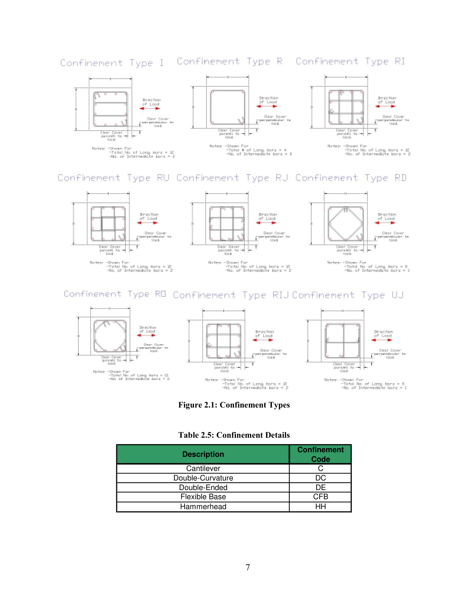

**图 2.1：约束类型**

## 2.4 试验构型

为了在较宽范围的试验构型之间一致地比较柱行为，试验构型和力-位移数据被化简为等效悬臂柱情形（图 2.2a）。柱数据库考虑的试验构型包括悬臂（图 2.2a）、双曲率（图 2.2b）、双端加载（图 2.2c）、锤头式（图 2.2d）和柔性基础（图 2.2e）。相应构型代码见表 2.5。

每种柱构型的等效悬臂长度 `L` 定义见图 2.2。对于每种构型，`Lmeas` 定义为测量柱侧向位移的标高到柱底之间的距离。对于大多数柱试验，`Lmeas` 等于 `L`。换言之，柱顶位移是在施加侧向力的标高处测得的。

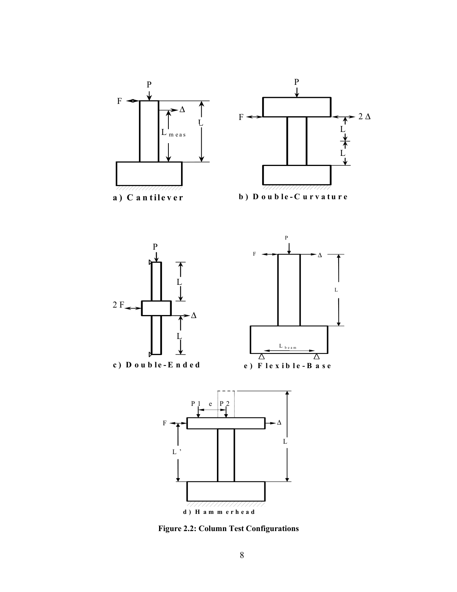

**图 2.2：柱试验构型**

**表 2.5：试验构型代码**

| 说明 | 构型代码 |
|---|---|
| 悬臂 | `C` |
| 双曲率 | `DC` |
| 双端加载 | `DE` |
| 柔性基础 | `CFB` |
| 锤头式 | `HH` |

# 第 3 章 试验结果

## 3.1 破坏分类

名义柱破坏模式按以下准则划分为弯曲控制、弯剪控制或剪切控制（见图 3.1）。如果试验者未报告剪切损伤，则将柱归类为弯曲控制。如果报告了剪切损伤，则将绝对最大有效力（`F_eff`）与对应最大应变 0.004 的计算力（`F_0.004`）比较，同时考虑 80% 有效力处的破坏位移延性 `μ_fail`。如果最大有效力小于理想力的 95%（`F_eff < 0.95 F_0.004`），或破坏位移延性小于等于 2（`μ_fail <= 2`），则将柱归类为剪切控制。否则，将柱归类为弯剪控制。

**表 3.1：破坏模式代码**

| 破坏模式 | 破坏代码 |
|---|---:|
| 弯曲 | 1 |
| 剪切 | 2 |
| 弯剪 | 3 |

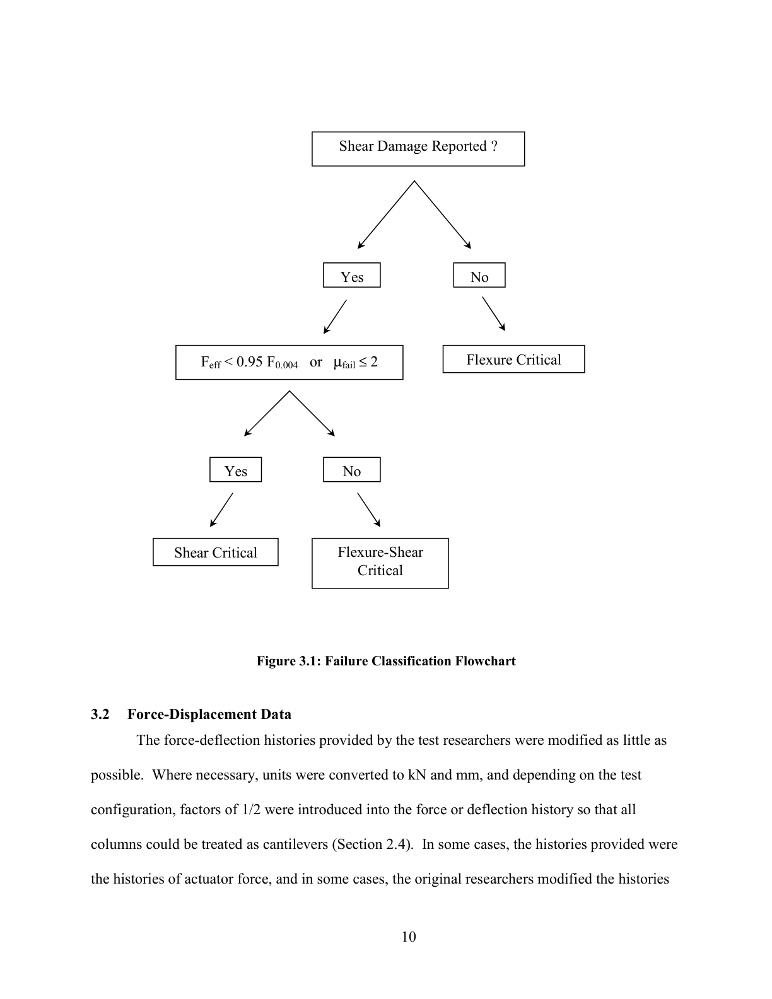

**图 3.1：破坏分类流程图**

## 3.2 力-位移数据

试验研究者提供的力-变形历程尽可能少作修改。必要时，将单位转换为 kN 和 mm；并根据试验构型，在力或位移历程中引入 1/2 的系数，使所有柱均可按悬臂柱处理（见 2.4 节）。在某些情况下，所提供的历程为作动器力历程；在另一些情况下，原研究者已对历程进行了修正以反映 P-Δ 效应。对于高轴向荷载和大位移试验，这些效应可能非常显著。

数据库以制表符分隔的 `.txt` 格式提供力-位移历程，可导入多种应用程序。每个侧向力-位移文件的第一行包含试验名称。第二行给出力-位移数据点数量。随后各行第一列为柱顶位移值（mm），第二列为侧向荷载值（kN）；在可获得时，第三列为轴向荷载值（kN）。无论试验构型如何，所有横向力-位移历程均以等效悬臂柱形式报告（见 2.4 节）。

## 3.3 轴向荷载的影响

为计入 P-Δ 效应，数据库中提供的柱力需要分解为竖向分量和水平分量。竖向分量可近似取为数据库中给出的轴向荷载 `P`。竖向作动器力的水平分量需要与水平作动器施加的力相加或相减，以得到净水平力。

为了使研究人员能够考虑 P-Δ 效应，数据库识别四类侧向力-位移历程（图 3.2）：

- **Type I**：研究者提供的力-变形数据为有效力 `F_eff` 与 `Lmeas` 标高处挠度 `Δ` 的关系。此时净水平力 `F_H` 可按式 3.1 确定：

```math
F_H = F_{eff} - P\Delta / L_{meas}
```

**Equation 3.1**

- **Type II**：研究者提供的力-变形数据为净水平力 `F_H` 与 `Lmeas` 标高处挠度 `Δ` 的关系。

```math
F_{Rep} = F_H
```

**Equation 3.2**

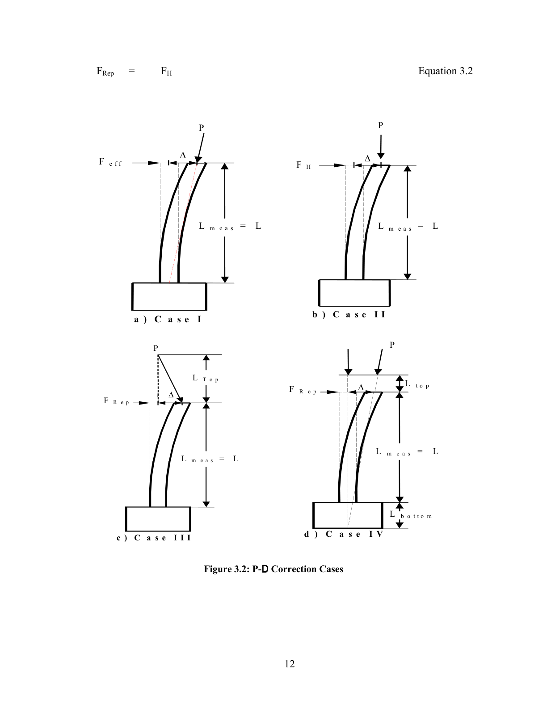

**图 3.2：P-Δ 修正情形**

- **Type III**：研究者提供的力数据表示水平作动器施加的侧向荷载，但竖向作动器顶部不发生平动。此时，为得到净水平力 `F_H`，需要将竖向加载作动器的水平分量加到报告力 `F_Rep` 上。

```math
F_H = F_{Rep} + P L_{Top} / \Delta
```

**Equation 3.3**

- **Type IV**：研究者提供的力数据表示水平作动器施加的侧向荷载。但是，轴向荷载并未施加在与侧向力相同的标高处，或者轴向荷载作用线未通过柱底。在这种情况下，从报告力 `F_Rep` 中扣除竖向加载作动器的水平分量 `P_H`，得到净水平力 `F_H`。

```math
\alpha = \tan^{-1}
\left[
\frac{\Delta \left(\frac{L + L_{top}}{L}\right)}
{L + L_{bot} + L_{top}}
\right]
```

**Equation 3.4**

```math
P_H = P \cdot \sin \alpha
```

**Equation 3.5**

```math
F_H = F_{Rep} - P_H
```

**Equation 3.6**

净水平力和重力（竖向）荷载对总柱底弯矩的贡献可按下式确定：

```math
M_{base} = F_H \cdot L + P \cdot \Delta \cdot
\left(\frac{L_{top} + L}{L_{meas}}\right)
```

**Equation 3.7**

其中：

| 符号 | 含义 |
|---|---|
| `F_H` | 净水平力（柱剪力） |
| `L` | 剪跨长度 |
| `P` | 重力（竖向）荷载 |
| `Δ` | 在悬臂标高 `Lmeas` 处测得的位移 |
| `Ltop` | 从施加侧向力标高到施加重力（竖向）荷载标高之间的距离 |
| `Lmeas` | 测量柱侧向位移的标高 |

于是有效力可定义为：

```math
F_{eff} = M_{base} / L
```

**Equation 3.8**

## 3.4 观测损伤

对于研究报告中记录了变形的柱试验，数据库提供达到某一损伤水平前的最大记录柱挠度 `Δ_Damage`（见图 3.3）。

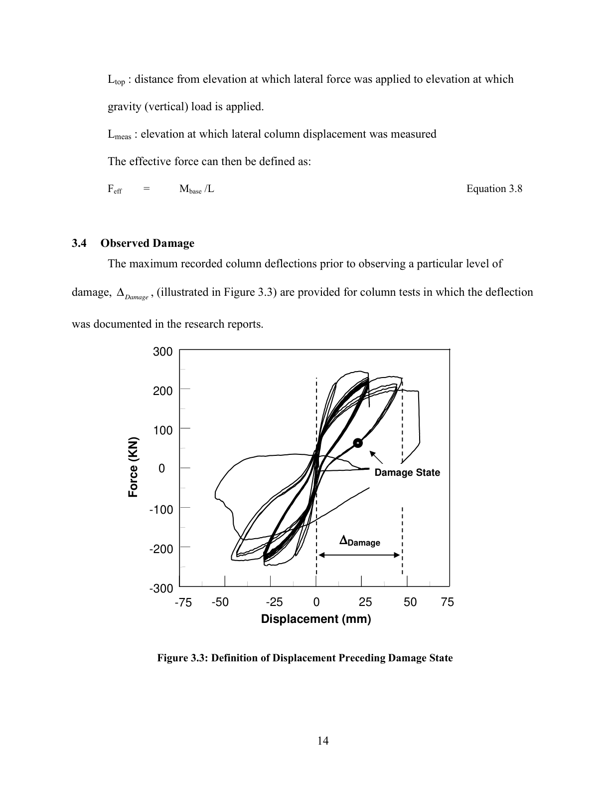

**图 3.3：损伤状态发生前位移的定义**

数据库针对以下七种损伤状态提供损伤变形 `Δ_Damage`。并非每个试验都报告所有损伤水平。

- **剥落开始**：定义为首次观察到剥落。
- **明显剥落开始**：定义为报告中观察到 “significant spalling” 或 “considerable spalling”。或者，如果可确定剥落高度，则明显剥落定义为剥落高度至少等于截面深度的 10%。
- **钢筋屈曲开始**：定义为首次观察到纵向钢筋屈曲迹象。
- **纵向钢筋断裂**：定义为首次观察到纵向钢筋断裂迹象。
- **横向钢筋断裂**：定义为首次观察到横向钢筋断裂或松脱迹象。
- **轴向承载力丧失**：定义为观察到柱丧失轴向荷载承载能力。
- **柱破坏**：该项针对 49 个试验报告；在本数据库中定义为以下事件之一的首次发生：纵向钢筋屈曲、横向钢筋断裂、纵向钢筋断裂或轴向承载力丧失。

# 第 4 章 可用数据的特征

本章汇总 PEER 结构性能数据库中的可用数据。对于矩形配筋柱和螺旋筋柱，分别考察关键柱属性的分布，包括截面深度、剪跨比/长细比指标、轴压比、纵向配筋率和横向配筋率。此外，本章列出截至 2004 年 1 月数据库中包含的 404 个试验，并给出数据注释和关键试验结果，例如柱所抵抗的最大弯矩和剪力。本章还报告柱的名义抗弯承载力。

PEER 数据库中的试验列于附录 A 和附录 B。附录还包含每个柱试验的数据注释、柱所抵抗的最大弯矩和剪力、实测最大弯矩与 ACI 名义弯矩（ACI 318-02）之比、Berry（2003）所述的理想屈服位移，以及破坏分类（见 3.1 节）。每个柱试验的参考文献见附录 D。

## 4.1 关键柱属性的分布

表 4.1 给出 274 个矩形配筋柱和 160 个螺旋筋柱关键柱属性的平均值和变异系数（CoV）。统计项包括柱截面深度、剪跨比/长细比指标、轴压比、纵向配筋率 `ρ_l` 和横向配筋率 `ρ_s`。

**表 4.1：柱属性统计**

| 柱属性 | 矩形配筋柱平均值 | 矩形配筋柱 Std | 矩形配筋柱 CoV | 螺旋筋柱平均值 | 螺旋筋柱 Std | 螺旋筋柱 CoV |
|---|---:|---:|---:|---:|---:|---:|
| Depth (mm) | 319 | 117 | 0.37 | 399 | 174 | 0.44 |
| Aspect Ratio | 3.58 | 1.46 | 0.41 | 3.44 | 2.01 | 0.59 |
| Axial-Load Ratio | 0.27 | 0.19 | 0.70 | 0.14 | 0.14 | 1.01 |
| `ρ_l` (%) | 2.39 | 0.96 | 0.40 | 2.66 | 1.03 | 0.39 |
| `ρ_s` (%) | 2.01 | 1.22 | 0.61 | 1.00 | 0.74 | 0.74 |

柱截面深度的分布见图 4.1。矩形配筋柱数据约以 319 mm 的平均值为中心呈近似正态分布。约 80% 的矩形配筋柱截面深度在 200 至 500 mm 之间。螺旋筋柱数据不呈正态分布。

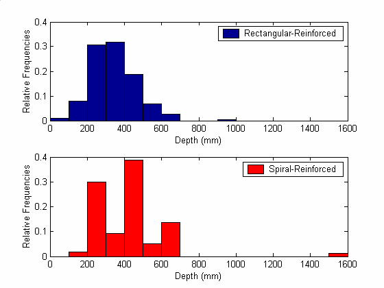

**图 4.1：柱截面深度分布**

柱剪跨比/长细比指标的分布见图 4.2。矩形配筋柱数据约以 3.6 的平均值为中心呈近似正态分布，并向较低指标值偏斜。螺旋筋柱数据偏向较低指标值，其中 49% 的螺旋筋柱该指标位于 1 至 3 之间。

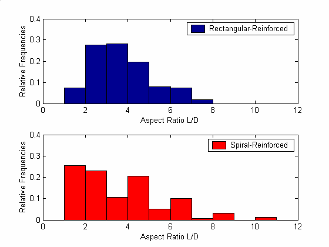

**图 4.2：柱剪跨比/长细比指标分布**

轴压比分布见图 4.3。矩形配筋柱和螺旋筋柱的分布均偏向较低轴压比。特别地，65% 的矩形配筋柱和 85% 的螺旋筋柱轴压比在 0 至 0.3 之间。

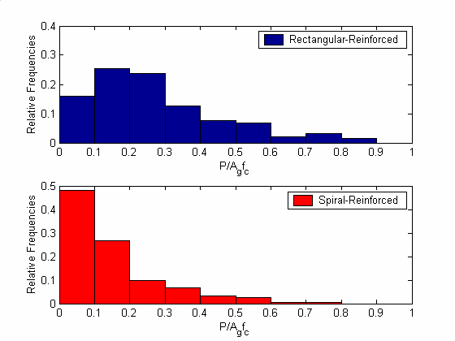

**图 4.3：轴压比分布**

纵向配筋率分布见图 4.4。矩形配筋柱数据约以 2.39% 的平均值为中心呈近似正态分布，并向较低配筋率偏斜。螺旋筋柱数据不呈正态分布。

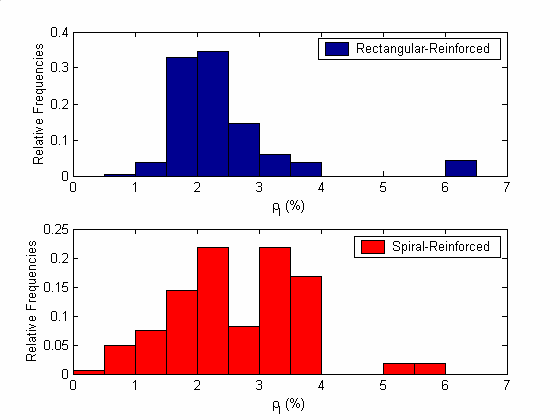

**图 4.4：纵向配筋率分布**

横向配筋率分布见图 4.5。矩形配筋柱数据围绕 2% 的平均值分布，但难以用某一分布形式简单表征。与矩形柱相比，螺旋筋柱往往具有较低的横向配筋率。近 50% 的螺旋筋柱横向配筋率在 0.5% 至 1.0% 之间。

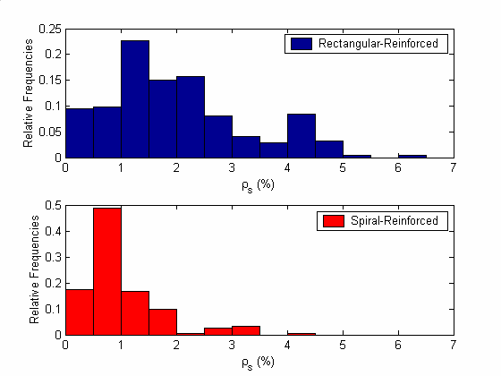

**图 4.5：横向配筋率分布**

## 4.2 按 ACI 计算的名义抗弯承载力

为给出数据库使用示例并帮助解释柱数据，本文按 ACI（2002）为数据库中每根柱计算了名义抗弯承载力。计算得到的弯矩承载力列于表 A.1 和表 B.1。此外，实测最大弯矩与 ACI 名义抗弯承载力之比的平均值和变异系数见表 4.2。Berry and Eberhard（2004）给出了 PEER 数据库可用于评估和开发性能模型的其他示例。

**表 4.2：计算抗弯承载力汇总**

| 柱类型 | 破坏模式 | 试验数 | `Mmax/MACI` 平均值 | CoV |
|---|---|---:|---:|---:|
| Rectangular-Reinforced | Flexure | 214 | 1.19 | 0.15 |
| Rectangular-Reinforced | Shear | 10 | 0.85 | 0.24 |
| Rectangular-Reinforced | Flexure-Shear | 44 | 1.25 | 0.28 |
| Spiral-Reinforced | Flexure | 87 | 1.25 | 0.12 |
| Spiral-Reinforced | Shear | 26 | 0.81 | 0.20 |
| Spiral-Reinforced | Flexure-Shear | 36 | 1.17 | 0.12 |

# 参考文献

American Concrete Institute (ACI 318-02), "Building Code Requirements for Structural Concrete", 2002.

Berry, M. P., and Eberhard, M. O. (2004). "A Practical Performance Model for Bar Buckling." J. Struct. Eng., under review.

Berry, M. P., and Eberhard, M. O. (2003). "Performance Models for Flexural Damage in Reinforced Concrete Columns." Pacific Earthquake Engineering Research Center Report 2003/??, University of California, Berkeley, California.

Camarillo, H. (2003). "Evaluation of Shear Strength Methodologies for Reinforced Concrete Columns." Master's Thesis, Dept. of Civil and Environmental Engineering, University of Washington, Seattle.

Mookerjee, A. (1999). "Reliability of Performance Estimates of Spiral and Hoop-Reinforced Concrete Columns." Master's Thesis, Dept. of Civil and Environmental Engineering, University of Washington, Seattle.

Parrish, M. (2001). "Accuracy of Seismic Performance Methodologies for Rectangular Reinforced Concrete Columns." Master's Thesis, Dept. of Civil and Environmental Engineering, University of Washington, Seattle.

Taylor, A.W., Kuo, C., Wellenius, K. and Chung, D. (1997). A Summary of Cyclic Lateral-Load Tests on Rectangular Reinforced Concrete Columns, National Institute of Standards and Technology, Report NISTIR 5984.

Taylor, A.W. and Stone, W.C. (1993). A Summary of Cyclic Lateral-Load Tests of Spiral Reinforced Concrete Columns, National Institute of Standards and Technology, Report NISTIR 5285.

# 附录 A 矩形配筋柱试验汇总

本附录简要汇总 PEER 结构性能数据库描述的钢筋混凝土柱试验。表 A.1 和表 B.1 中列出的柱最大弯矩 `Mmax` 是根据试验数据并计入 P-Δ 效应计算得到的。ACI 名义抗弯承载力 `MACI` 按 ACI《Building Code Requirements for Structural Concrete》（ACI 318-02）的规定计算。名义屈服位移按 Berry and Eberhard（2003）描述的方法计算。破坏模式定义见第 3.1 节（表 3.1）。

**表 A.1：矩形配筋柱试验汇总**

表头含义：

| 英文字段 | 中文含义 |
|---|---|
| `Test Number` | 试验编号 |
| `Reference` | 参考文献 |
| `Column Designation` | 柱试件编号/名称 |
| `Comments` | 注释 |
| `MMAX (kN-m)` | 最大弯矩 |
| `MMAX / MACI` | 最大弯矩与 ACI 名义抗弯承载力之比 |
| `VMAX (kN)` | 最大剪力 |
| `Δy (mm)` | 屈服位移 |
| `Failure Mode` | 破坏模式 |

> 为保持原表数值、换行和试件编号不变，表 A.1 以原版页面图像形式保留。

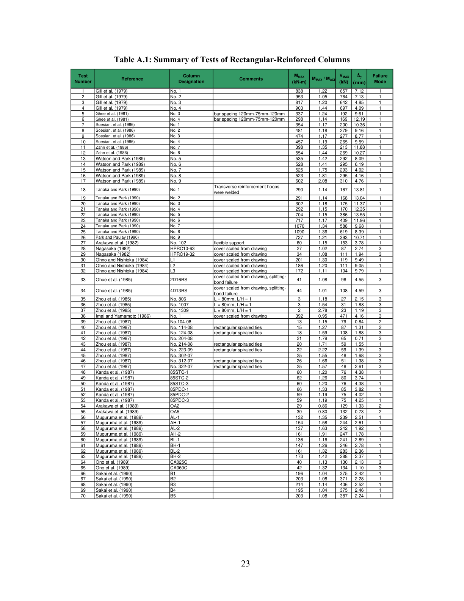

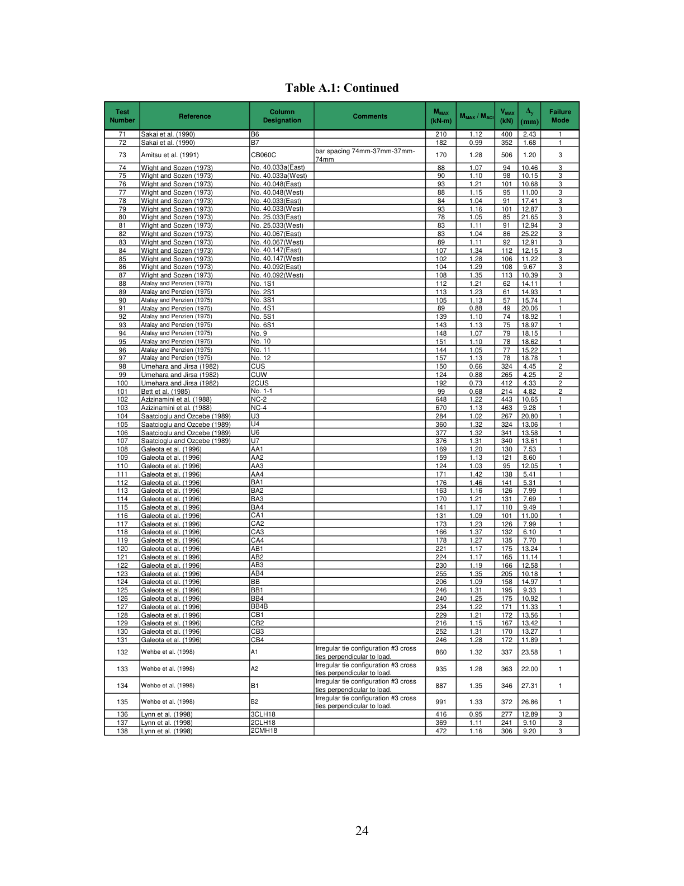

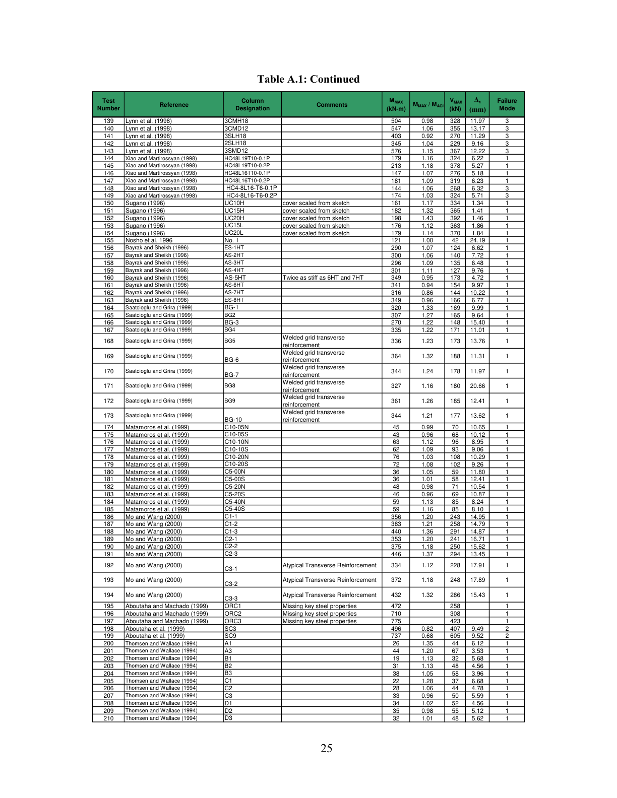

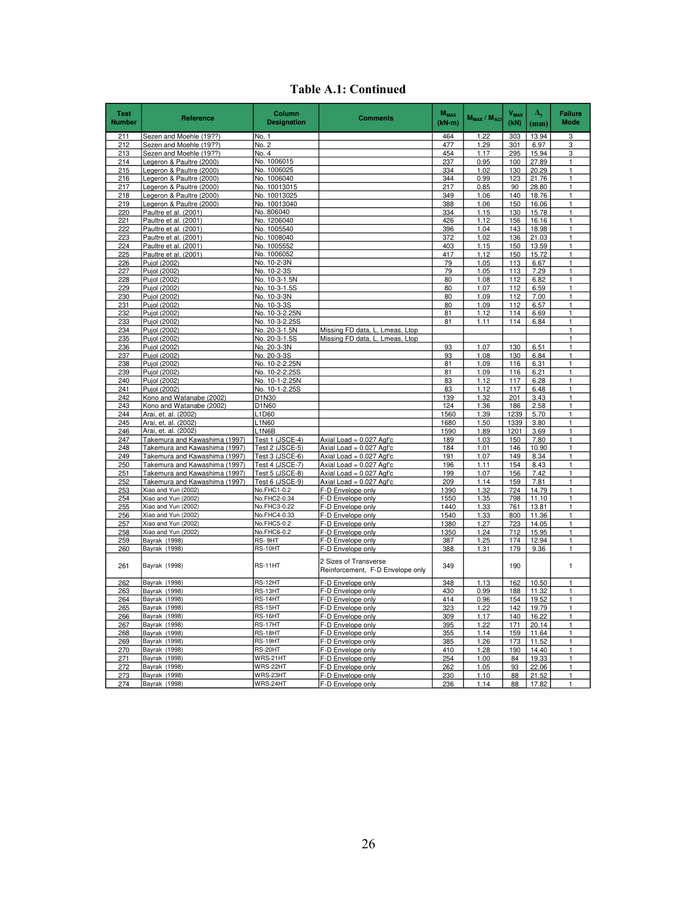

# 附录 B 螺旋筋柱试验汇总

**表 B.1：螺旋筋柱试验汇总**

表头含义与附录 A 相同。为保持原始数据和页面排版，表 B.1 以原版页面图像形式保留。

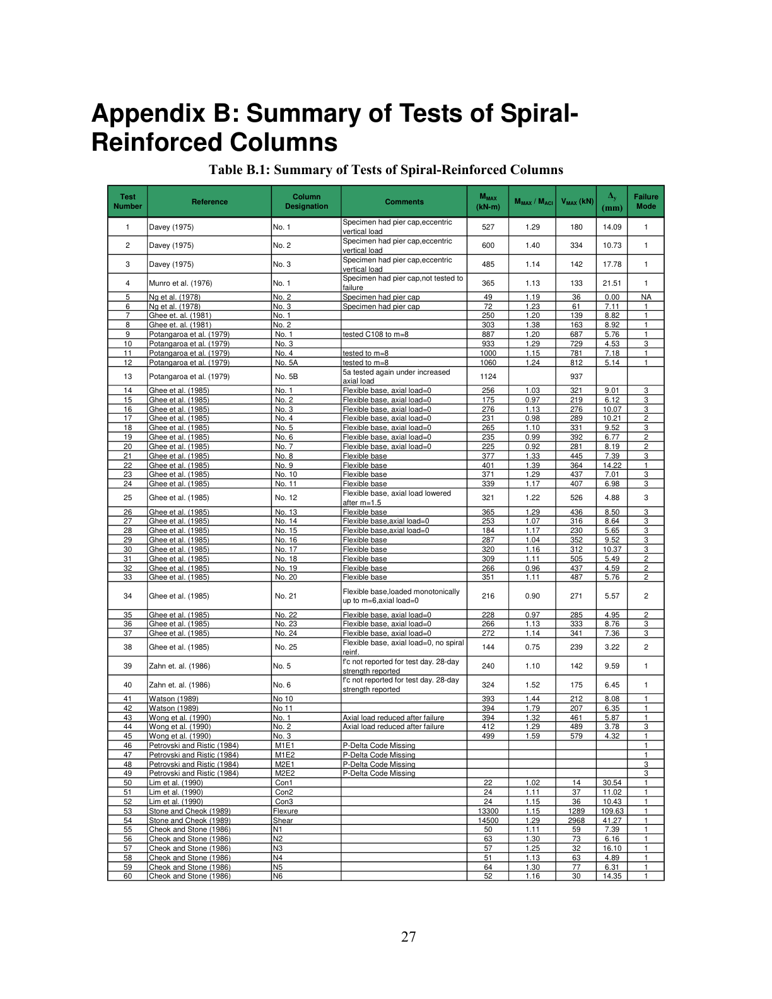

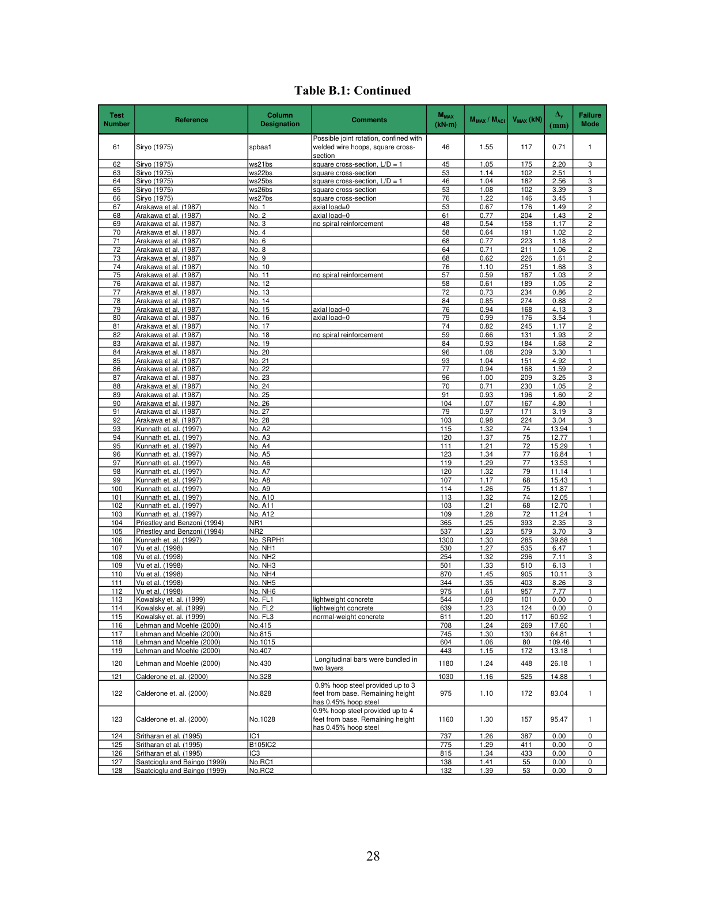

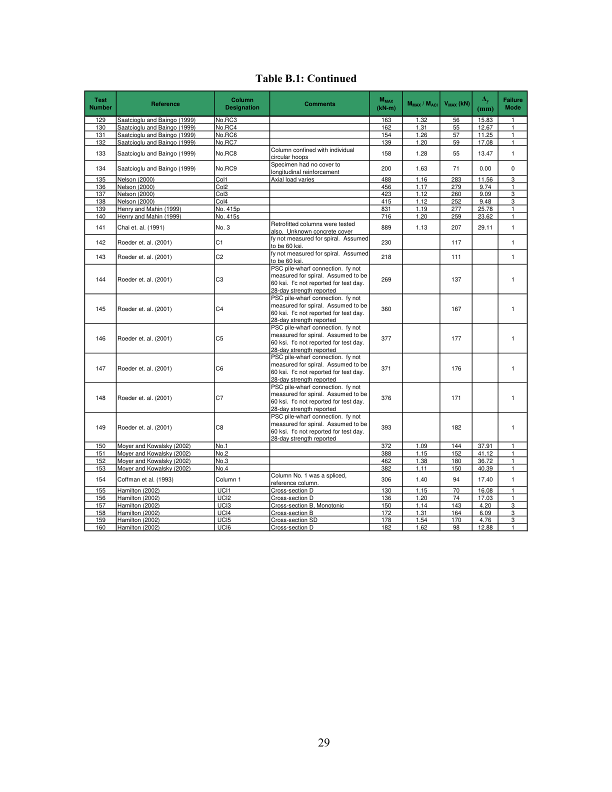

# 附录 C XML 数据结构

本附录说明数据库（http://nisee.berkeley.edu/spd）中描述每个柱试验的 XML 文件结构。XML 文件中的柱数据组织为 10 个数据结构：`specimen`、`adminInfo`、`materialProperties`、`geometry`、`loading`、`longitudinalReinforcement`、`transverseReinforcement`、`failureType`、`damage` 和 `links`。其中关键数据结构，即 `materialProperties`、`geometry`、`longitudinalReinforcement` 和 `transverseReinforcement` 的组织方式汇总于表 C.1 至表 C.4。

**表 C.1：`materialProperties` 结构组织**

| 结构字段 | 子字段 | XML 符号 | 属性说明 | 柱类型 |
|---|---|---|---|---|
| `concreteStrength` |  | `concreteStrength` | 混凝土特征抗压强度（MPa） | R, S |
| `longitudinalSteel` |  | `yieldStress` | 纵向钢筋屈服应力（MPa） | S |
| `longitudinalSteel` |  | `strength` | 纵向钢筋极限强度（MPa） | S |
| `longitudinalSteel` | `corner` | `yieldStress` | 纵向角筋屈服应力（MPa） | R |
| `longitudinalSteel` | `corner` | `strength` | 纵向角筋极限强度（MPa） | R |
| `longitudinalSteel` | `intermediate` | `yieldStress` | 纵向中间筋屈服应力（MPa） | R |
| `longitudinalSteel` | `intermediate` | `strength` | 纵向中间筋极限强度（MPa） | R |
| `transverseSteel` |  | `yieldStress` | 横向钢筋屈服应力（MPa） | R, S |
| `transverseSteel` |  | `strength` | 横向钢筋极限强度（MPa） | R, S |

**表 C.2：`geometry` 结构组织**

| XML 符号 | 属性说明 | 柱类型 |
|---|---|---|
| `depth` | 柱截面深度（mm） | R, S |
| `width` | 柱截面宽度（mm） | R |
| `lInflection` | 等效悬臂柱长度（mm） | R, S |
| `configuration` | 试验构型（见第 2.4 节） | R, S |
| `lSplice` | 纵向钢筋搭接长度 | R, S |
| `lMeasured` | 变形测量距离（见第 3.3 节） | R, S |

**表 C.3：`longitudinalReinforcement` 结构组织**

| 结构字段 | XML 符号 | 属性说明 | 柱类型 |
|---|---|---|---|
|  | `numberOfBars` | 纵向钢筋根数 | R, S |
|  | `diameter` | 纵向钢筋直径（mm） | S |
|  | `diameter` | 纵向角筋直径（mm） | R |
|  | `diameterIntermediate` | 纵向中间筋直径（mm） | R |
|  | `reinforcementRatio` | 纵向配筋率（计算值） | R, S |
| `parallelToLoad` | `clearCover` | 从柱表面到横向钢筋外边缘的距离（mm），平行于水平荷载方向 | R |
| `parallelToLoad` | `numberIntermediateBars` | 平行于水平荷载方向的中间筋数量 | R |
| `perpendicularToLoad` | `clearCover` | 从柱表面到横向钢筋外边缘的距离（mm），垂直于水平荷载方向 | R |
| `perpendicularToLoad` | `numberIntermediateBars` | 垂直于水平荷载方向的中间筋数量 | R |

**表 C.4：`transverseReinforcement` 结构组织**

| 结构字段 | XML 符号 | 属性说明 | 柱类型 |
|---|---|---|---|
| `closeSpacing` | `barDiameter` | 横向钢筋直径（mm） | R, S |
| `closeSpacing` | `hoopSpacing` | 横向钢筋间距（mm） | R, S |
|  | `volTransReinfRatio` | 体积横向配筋率（报告值） | R, S |
|  | `numberShearLegs` | 截面内横向抗剪钢筋肢数 | R, S |
|  | `type` | 约束类型（见第 2.3 节） | R |

# 附录 D 柱试验参考文献

本附录为数据库所用柱试验的原始参考文献清单。为保持引用准确性，文献条目保持英文原文格式。完整条目见原 PDF 第 33 至 38 页，或本地文件：

```text
performance_database_manual_1-0.pdf
```

使用数据库进行论文、报告或模型校准时，应优先引用具体试件对应的原始参考文献；本手册和 PEER 数据库可作为数据汇编来源共同引用。
